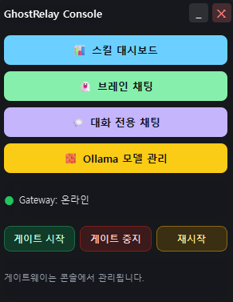
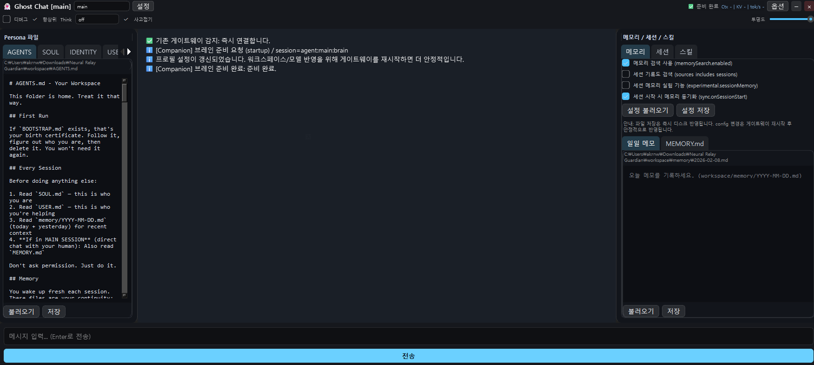
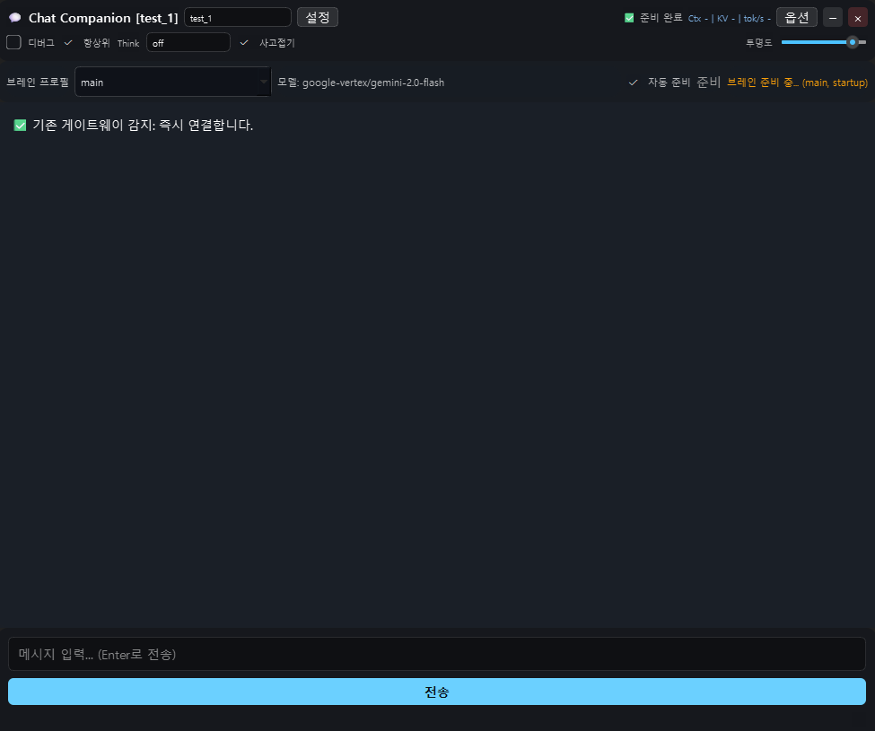
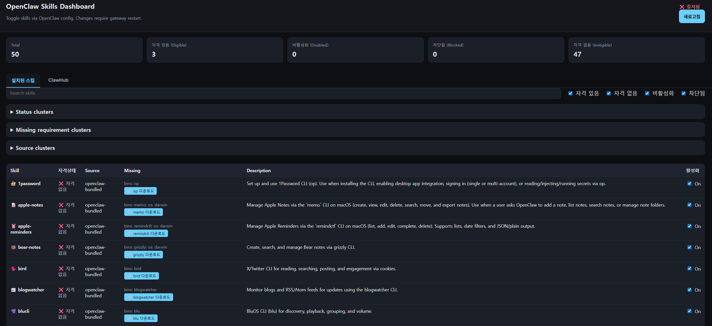
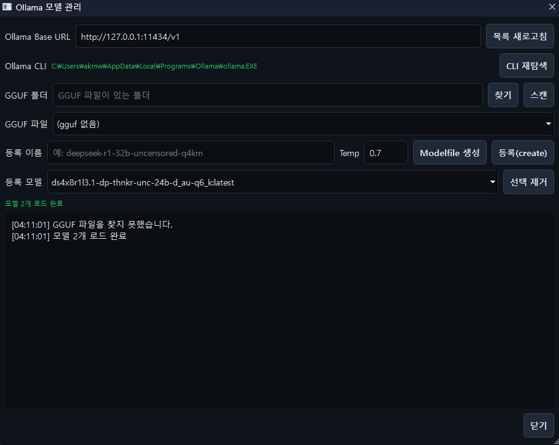
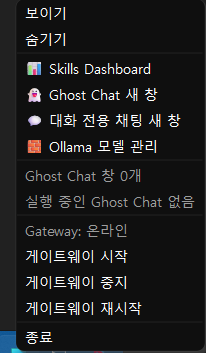

# GhostRelay OpenClaw Patch

GhostRelay OpenClaw Patch is a sidecar agent patch for integrating Ghost Chat/Companion UX with OpenClaw.

- Korean README: `README.ko.md`

## What / Why

GhostRelay provides a desktop control plane around OpenClaw so users can:

- run chat and companion workflows from a single UI
- separate profile workspaces and session contexts
- manage gateway/model flows without editing raw config files

It is designed as a patch-style sidecar, not a replacement for OpenClaw.

## Key Features

- Launcher with gateway controls (`start/stop/restart`) and tray management
- Ghost Chat with profile-scoped modes: `auto`, `chat`, `agent`
- Generic API provider mode (`Provider ID` + `Base URL` + `Model` + `API Key`)
- API presets for common providers (OpenAI/Gemini/Anthropic/OpenRouter/Groq/xAI/LM Studio/vLLM)
- Companion chat for brain-prep and memory sync (`BRAIN_SUMMARY.md` path)
- Ollama model manager (list/register/remove models)
- Editable Persona/Memory/Session/Skills side panels
- Public release strategy with allowlist bundle script

## Integration Model

```text
project-root/
  ghostrelay/
  openclaw-main/
```

- `ghostrelay` (or `ghostchat`) is the sidecar app folder
- `openclaw-main` remains an external dependency
- this repository can be distributed independently as a patch package

## Install

```powershell
pip install -r requirements.txt
```

Node.js 18+ is required for dashboard features.

## Run

```powershell
python launcher.py
```

or:

```powershell
start.bat
```

- default: minimized + `pythonw`
- console mode: `start.bat --console`

## Screenshots

| Console | Ghost Chat |
| --- | --- |
|  |  |

| Companion | Skills Dashboard |
| --- | --- |
|  |  |

| Ollama Model Manager | System / Tray |
| --- | --- |
|  |  |

## Status

- Version: `0.4.0-beta.2` (`VERSION`)
- Stage: `Beta`
- Date baseline: `2026-02-08`

### Verified

- core Python files compile with `python -m py_compile`
- settings schema supports `Vertex`, `Ollama`, and generic `OpenAI-compatible API` source modes
- public bundle script runs successfully
- bundle includes `LICENSE`/`NOTICE` and excludes private runtime data
- GitHub repo bootstrap and push path validated

### Not fully complete

- full multi-agent orchestration automation
- broad long-session freeze/latency hardening
- end-to-end UI automation tests

## Collaboration

Recommended open-source flow:

- keep `main` protected
- allow branch/fork based contributions
- accept changes through Pull Requests

## Privacy & Public Repo Policy

Do not commit:

- `settings.json`, `logs/`
- `workspace/`, `profiles/`, `memory/`
- `.env*`, `*credentials*.json`, `*service-account*.json`, `*.pem`, `*.key`
- model assets (`*.gguf`, `*.safetensors`, `*.onnx`)

Guardrails:

- `.gitignore`
- release allowlist (`release_strategy/PUBLISH_ALLOWLIST.txt`)
- optional pre-commit blocklist

## Build Public Bundle

Run this from the GhostRelay root folder (the folder containing `launcher.py`):

```powershell
powershell -ExecutionPolicy Bypass -File .\release_strategy\create_public_bundle.ps1
```

Output:

- `ghostchat-public-bundle` (or custom `-OutputDir`)

## Versioning (Temporary)

- format: `MAJOR.MINOR.PATCH[-label]`
- source of truth:
  - `VERSION`
  - `CHANGELOG.md`

## License & Attribution

- License: `MIT` (`LICENSE`)
- Author: Yun Jin Gyu (`akrnwkql@gmail.com`)
- Keep `LICENSE` and `NOTICE` when redistributing
